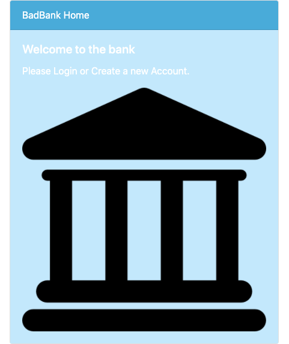

# BadBank
<h1></h1>
Full-Stack Banking Application Project for MIT xPro

<h3>Description</h3>

Bad bank application project uses a 3 tier application using react
for the front-end and node and express to create the server side back-end.
this project uses mongoDB for the database and is packaged into
a docker container.

<h3>How to Install</h3>
Clone the project on to your machine, open the terminal and the following commands:

1. npm init
2. npm install express
3. npm install cors
4. npm install mongoDB
5. docker run -p 27017:27017 -name badbank -d mongoDB
6. node index.js
7. This will start the project on your browser url http://localhost:3000/#/  

<h3>Stack Used</h3>

1. HTML, CSS , JS
2. Bootstrap v5+
3. React
4. Node/Express
5. MongoDB
6. Docker

<h3>Features</h3>

The project has the following features:
* Authentication / Authorization for current users
* Create new accounts for new users
* View balances and other user specific information
* Deposit and withdraw funds and have an updated balance

There are many improvements in the pipeline, such as:
* Stylize landing page with cards
*  Insert link to book appointment
*  Include additional links for Credit Cards, Checking, Savings, Mortgage, Refinance, Investing

<h3>License</h3>
MIT License

Copyright (c) 2021 Jennifer Tam

Permission is hereby granted, free of charge, to any person obtaining a copy
of this software and associated documentation files (the "Software"), to deal
in the Software without restriction, including without limitation the rights
to use, copy, modify, merge, publish, distribute, sublicense, and/or sell
copies of the Software, and to permit persons to whom the Software is
furnished to do so, subject to the following conditions:

The above copyright notice and this permission notice shall be included in all
copies or substantial portions of the Software.

THE SOFTWARE IS PROVIDED "AS IS", WITHOUT WARRANTY OF ANY KIND, EXPRESS OR
IMPLIED, INCLUDING BUT NOT LIMITED TO THE WARRANTIES OF MERCHANTABILITY,
FITNESS FOR A PARTICULAR PURPOSE AND NONINFRINGEMENT. IN NO EVENT SHALL THE
AUTHORS OR COPYRIGHT HOLDERS BE LIABLE FOR ANY CLAIM, DAMAGES OR OTHER
LIABILITY, WHETHER IN AN ACTION OF CONTRACT, TORT OR OTHERWISE, ARISING FROM,
OUT OF OR IN CONNECTION WITH THE SOFTWARE OR THE USE OR OTHER DEALINGS IN THE
SOFTWARE.
